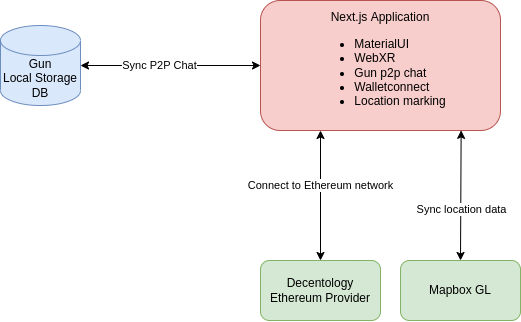

# ExperiAR


[View our presentation](https://docs.google.com/presentation/d/1uVWPMDMyT6LJH023atvX9sl-Qg_z-C61Q7M9T1N23ns/edit?usp=sharing)

AR web app for NFT location based meetup

## System overview




## Web3

This project uses the web3 wallet connection providers from Decentology's [hyperverse-mono repository](https://github.com/decentology/hyperverse-mono).

## Peer to peer

The direct wallet to wallet messaging system is being developed using [GUN](https://github.com/amark/gun) a peer-to-peer decentralized chat application.

## AR

Augmented reality is added using the common webxr libraries used to power mobile browsers today.

## Next.js

This is a [Next.js](https://nextjs.org/) project bootstrapped with [`create-next-app`](https://github.com/vercel/next.js/tree/canary/packages/create-next-app).

## Getting Started

First, run the development server:

```bash
yarn dev
```
